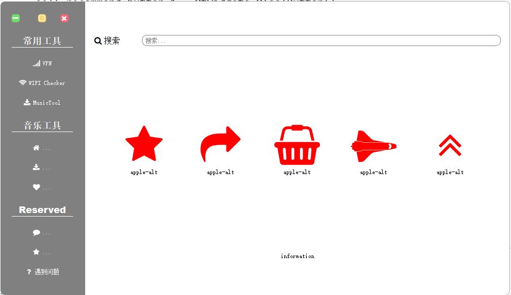
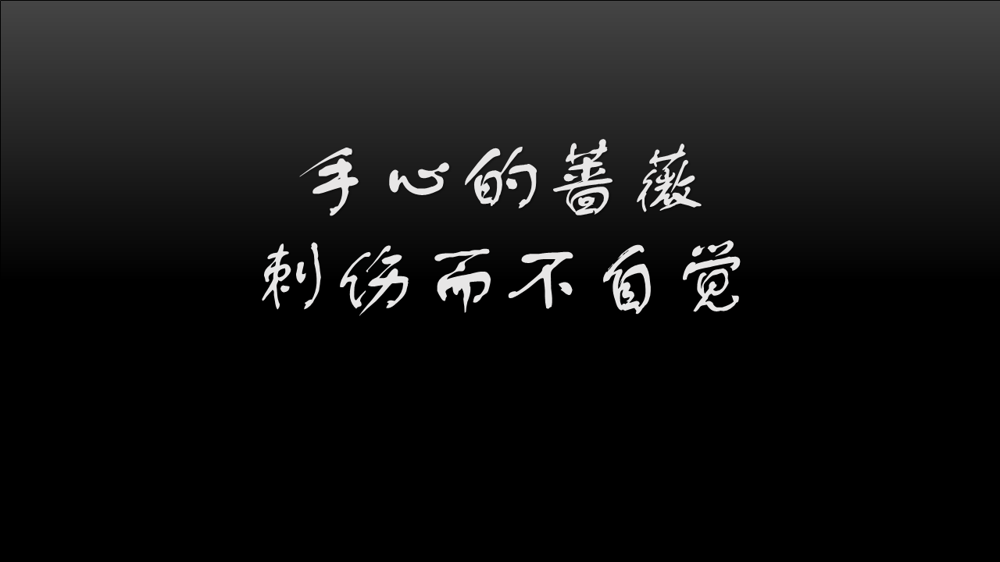

# Tool In One

​	使用PyQt将常用的小功能集合在一个软件中，方便调用管理。

- 电脑WiFi密码查看；
- VPN脚本启动；
- 壁纸管理（下载|重命名）
- ....

## 主页设计

## lyrics board

效果图：

思路：

根据lyrics文件时间戳，生成对应背景图片。

## you-get downloader

输入视频链接→选择视频格式→下载视频到指定文件夹

## m3u链接有效性检测

- 通过链接地址请求状态回复码检测其有效性；

## Ticker

PyTicker

1. pyqt 表盘时钟效果实现；（静态图片）

https://www.cnblogs.com/zach0812/p/13121523.html

1. 使用https://www.wiz.cn/zh-cn markdown文件分析时间
2. colorpicker https://colorpicker.me/#6a63cb
3. 首次使用需要进行配置
4. 导出为多文件安装包(或者是进行文件配置)
5. 。。。

小时钟架构

- 功能

  - 1.基本时间显示（动态圆表盘）
    - 2.时间段变色（恢复）

- 外观

  - deer表盘背景
  - 动态指针
  - 时间段变色

  

## issue

1. 按键点击绑定事件无法在模块外部响应；
2. 脚本无法正常启动外部程序（使用popen启用进程，脚本运行结束之后进程同时关闭）；
3. setstylesheet完全用法[Qt Style Sheets Examples — Qt for Python](https://doc.qt.io/qtforpython/overviews/stylesheet-examples.html)
4. ...

## Reference

[zetcode-pyqt5](http://zetcode.com/gui/pyqt)

[pyqt的多Button的点击事件的槽函数的区分发送signal的按钮](https://www.cnblogs.com/ribavnu/p/4672880.html)

[Qt 之 show,hide,setVisible,setHidden,close 等小结](https://blog.csdn.net/dbzhang800/article/details/6300021)

[qtawesome](https://github.com/spyder-ide/qtawesome)

[painting in pyqt5](https://zetcode.com/gui/pyqt5/painting/)

[pyqt圆形图片](https://blog.pyqt5.com/circleimage.html)

[python path](https://zhuanlan.zhihu.com/p/139783331)

[qt坐标系统](http://shouce.jb51.net/qt-beginning/20.html)