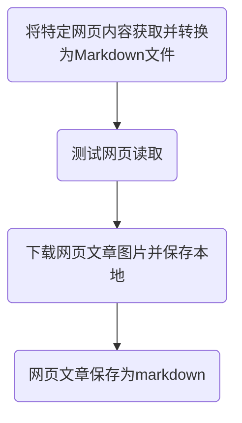

## Tasks

```mermaid
graph TD
a(将特定网页内容获取并转换为Markdown文件)-->
b(测试网页读取)-->
c(下载网页文章图片并保存本地)-->
d(网页文章保存为markdown)


```

**已完成**：

- [x] 从网页保存CSDN文章
- [x] 将本地保存网页缓存保存为*.md

**Todo:**

- [ ] 其他网页读取
- [ ] 图片网页路径转换为本地路径